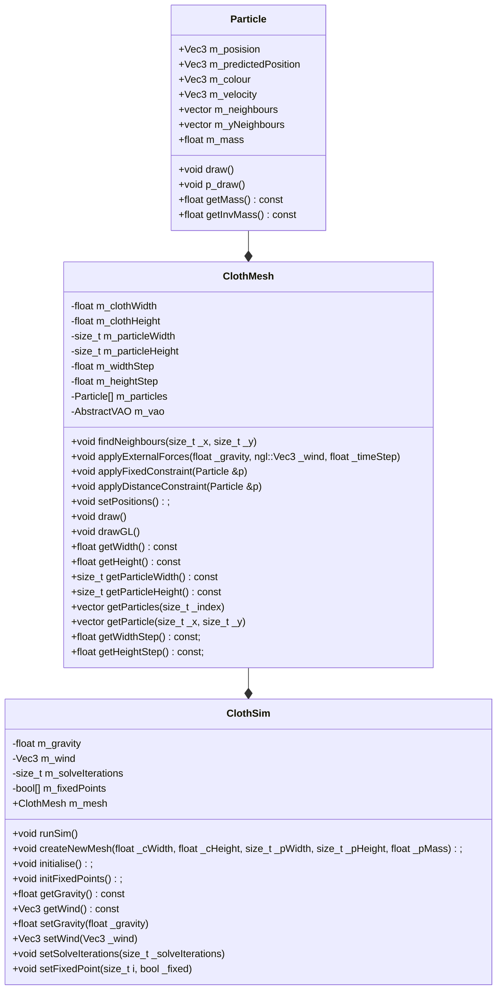

# Jack Purkiss Position Based Dynamics Cloth Simulator Project

## How to operate

This project can be build with CMake and requires the NGL library and Qt version 5 or higher. The NGL library can be found [here](https://github.com/NCCA/NGL). A compiler that supports C++17 is also required to run. Once compiled you can run and use the GUI to create a mesh of a desired size and adjust parameters in external forces, fixed points of the cloth and solve iterations.

## Overview

For my assignment I will create a program that demonstrates a cloth simulator built with Position Based Dynamics.

It will be using a Position-based Dynamics system, largely insired by [Bartels' masters thesis](https://nccastaff.bournemouth.ac.uk/jmacey/MastersProject/MSc15/03Pieterjan/thesis.pdf),  where the behaviour of the cloth m_mesh is determined by a set of m_particles that have various constraints connecting them. [This video](https://www.youtube.com/watch?m_v=z5oWopN39OU&ab_channel=TenMinutePhysics) looks at zero compliance distance constraints, which takes in a bending resitance parameter handling a constraint between two neighbouring triangles. He discusses two approaches to this, being an additional distance constraint between opposing m_particles, or the angle between triangles. We will initially be looking into the construction of this model using distance constraints. We will be applying the distance constraint to neighbouring m_particles, so that they remain the same distance from each other at all times. This will be done by finding the distance between the two m_particles, and then moving them so that they are the correct distance apart. This will be done by moving the m_particles along the line between them, so that they are the correct distance apart. This will be done by moving the m_particles along the line between them, so that they are the correct distance apart. This will be done by moving the m_particles along the line between them, so that they are the correct distance apart. This will be done by moving the m_particles along the line between them, so that they are the correct distance apart. This will be done by moving the m_particles along the line between them, so that they are the correct distance apart. This will be done by moving the m_particles along the line between them, so that they are the correct distance apart. This will be done by moving the m_particles along the line between them, so that they are the correct distance apart. This will be done by moving the m_particles along the line between them, so that they are the correct distance apart. This will be done by moving the m_particles along the line between them, so that they remain a correct distance apart. 

For the data, a m_mesh will be created to represent the cloth, which will be made up of vertices stored as Particle objects. A particle is constructed with a position vector and is assigned a m_mass and velocity. To begin with, the velocity will be zero. The external forces, in this case m_gravity and m_wind are then applied and solved for each of the m_particles, so their new predicted positions can be found. To start, this will involve a fixed position constraint, to hold certain m_particles in the cloth in place, and a distance constraint. This will ensure that neighbouring m_particles remain the same distance from each other at all times. The sim loop will then run continuously, based off of a given timestep. A GUI will be used to input the parameters like m_gravity and m_wind, and potentially others that will be explored later.

Here is a basic class diagram for the program. This is somewhat of a placeholder and will be developed as further understanding of the program is gained.

## Evaluation and Future Work

I have implemented a simple position based cloth simulation that allows a particle mesh to interact with external forces and stretch appropriately. This has been done using distance constraints between particles and running with a given number of solve iterations. In the future, I would first add a complete mesh with a triangulated grid to represent the cloth as more than just particles. Additionally, I would fully implement the technique as seen in the literature, with triangle neighbours sharing edges and using a bending constraint alongside the distance constraint that I have used. I would add velocity dampening to provide more control over the simulation, and internal and external collisions to make a more accurate simulator. I would also provide functionality for the user to interact with the cloth directly and set it up in more ways than some pre defined fixed points.