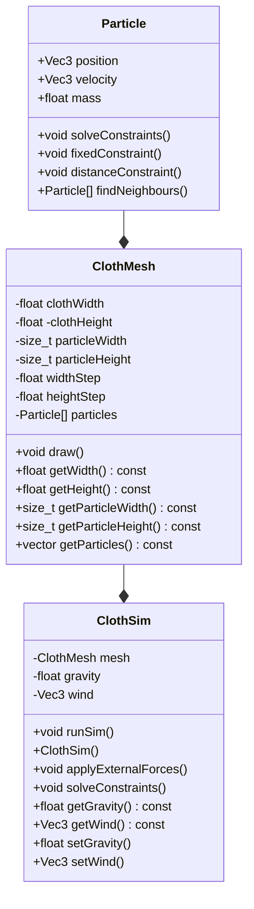

# Jack Purkiss Position Based Dynamics Cloth Simulator Project

## Overview

For my assignment I will create a program that demonstrates a cloth simulator built with Position Based Dynamics.

It will be using a Position-based Dynamics system, largely insired by [Bartels' masters thesis](https://nccastaff.bournemouth.ac.uk/jmacey/MastersProject/MSc15/03Pieterjan/thesis.pdf),  where the behaviour of the cloth mesh is determined by a set of particles that have various constraints connecting them. [This video](https://www.youtube.com/watch?v=z5oWopN39OU&ab_channel=TenMinutePhysics) looks at zero compliance distance constraints, which takes in a bending resitance parameter handling a constraint between two neighbouring triangles. He discusses two approaches to this, being an additional distance constraint between opposing particles, or the angle between triangles. We will initially be looking into the construction of this model using distance constraints, and then may progrress further into the use of others.

For the data, a mesh will be created to represent the cloth, which will be made up of vertices stored as Particle objects. These vertices connect to form a triangulated mesh. A particle is constructed with a position vector and is assigned a mass and velocity. To begin with, the velocity will be zero. The external forces, in this case gravity and wind are then applied and solved for each of the particles, so their new positions can be found. To start, this will involve a fixed position constraint, to hold certain particles in the cloth in place, and a distance constraint. This will ensure that neighbouring particles remain the same distance from each other at all times. The sim loop will then run continuously, based off of a given timestep. A GUI will be used to input the parameters like gravity and wind, and potentially others that will be explored later.

Here is a basic class diagram for the program. This is somewhat of a placeholder and will be developed as further understanding of the program is gained.

